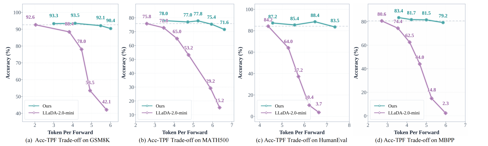
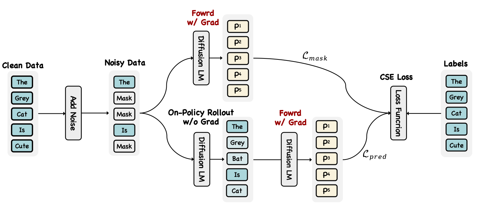
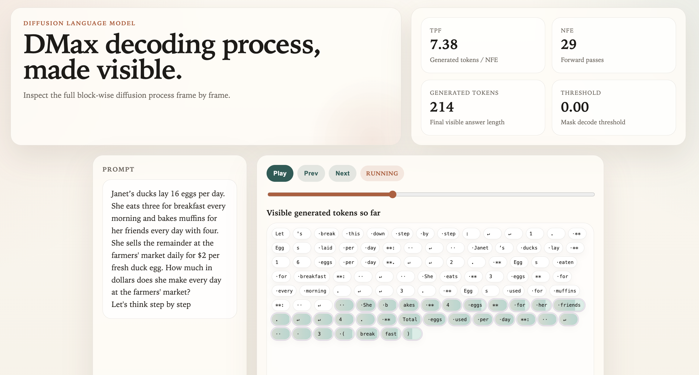

<div align="center">

# 🚀 DMax: Aggressive Parallel Decoding for dLLMs

<p>
  <a href="https://github.com/czg1225/DMax/blob/main/LICENSE">
    
  </a>
  <a href="https://github.com/czg1225/DMax">
    
  </a>
  <a href="https://huggingface.co/collections/Zigeng/dmax-models">
    
  </a>
  <a href="https://huggingface.co/collections/Zigeng/dmax-training-data">
    
  </a>
</p>

<p><strong>DMax is a new dLLM paradigm achieving aggressive parallel decoding while preserving generation quality.</strong></p>

</div>

https://github.com/user-attachments/assets/4856fa9e-9dae-41b7-9716-568f36a0f638

> **DMax: Aggressive Parallel Decoding for dLLMs**  
> [Zigeng Chen](https://czg1225.github.io/chenzigeng99/), [Gongfan Fang](https://fangggf.github.io/), [Xinyin Ma](https://horseee.github.io/), [Ruonan Yu](https://scholar.google.com/citations?user=UHP95egAAAAJ&hl=en), [Xinchao Wang](https://sites.google.com/site/sitexinchaowang/)  
> [xML Lab](https://sites.google.com/view/xml-nus), National University of Singapore \
> Paper [Arxiv](https://github.com/czg1225/DMax)

---

<a id="updates"></a>

##  Updates

- **[April 10, 2026]**: Code, model and dataset are released.

---

<a id="highliths"></a>

## Highlights

- **Aggressive Decoding Parallelism**: Achieves 6.0 TPF on math and reasoning tasks and 6.6 TPF on code tasks while preserving accuracy.
- **Self-Revising dLLM**: Extends a pretrained MDLM into a UDLM with an intrinsic ability to revise its own erroneous predictions during decoding.
- **Soft Parallel Decoding**: Uses interpolation between mask and token embeddings to propagate confidence priors from previous steps.

<div align="center">
  
  <br>
  <em>Superior Parallelism-Accuracy Trade-off, Increased TPF with Maintained Accuracy.</em>
</div>

---

## 📚 Table of Contents

- [💡 Introduction](#introduction)
- [💻 Model and Datasets](#model-and-datasets)
- [🚀 Quick Start](#quick-start)
- [🔧 Installation](#installation)
- [🔥 Training](#training)
- [⚡ Evaluation](#evaluation)
- [🔍 Decoding Process Visualization](#decoding-process-visualization)
- [📖 Experimental Results](#experimental-results)
- [☀️ Acknowledgement](#acknowledgement)
- [📚 Citation](#citations)

---

<a id="introduction"></a>

## 💡 Introduction

We present DMax, a new paradigm for efficient dLLMs. It mitigates error accumulation in parallel decoding, enabling aggressive decoding parallelism while preserving generation quality. Unlike conventional masked dLLMs that decode through a binary mask-to-token transition, DMax reformulates decoding as a progressive self-refinement from mask embeddings to token embeddings. At the core of our approach is On-Policy Uniform Training, a novel training strategy that efficiently unifies masked and uniform dLLMs, equipping the model to recover clean tokens from both masked inputs and its own erroneous predictions. Building on this foundation, we further intoduce Soft Parallel Decoding. Extensive experiments across a variety of benchmarks demonstrate the effectiveness of DMax.

<!--  -->
<div align="center">
  
  <br>
  <em>Overview of the On-Policy Uniform Training.</em>
</div>

---

<a id="model-and-datasets"></a>

## 💻 Model and Datasets

| Model | Description | Source Model | Link |
| --- | --- | --- | --- |
| 🤖 DMax-Math-16B | Highly parallel dLLM for math and reasoning. | LLaDA-2.0-mini | [Hugging Face](https://huggingface.co/Zigeng/DMax-Math-16B) |
| 🤖 DMax-Coder-16B | Highly parallel dLLM for code generation. | LLaDA-2.0-mini | [Hugging Face](https://huggingface.co/Zigeng/DMax-Coder-16B) |
| 🤖 DMax-16B | Highly parallel general-purpose dLLM. | LLaDA-2.0-mini | Coming soon |

| Dataset | Description | Link |
| --- | --- | --- |
| 📊 DMax-Math-Training-Data | Trajectories on math problems generated by LLaDA-2.0-mini | [Hugging Face](https://huggingface.co/datasets/Zigeng/DMax-LLaDA-2.0-Mini-Math-Trajectories) |
| 📊 DMax-Code-Training-Data | Trajectories on code problems generated by LLaDA-2.0-mini | [Hugging Face](https://huggingface.co/datasets/Zigeng/DMax-LLaDA-2.0-Mini-Code-Trajectories) |

---


<a id="quick-start"></a>

## 🚀 Quick Start

```python
import torch
from transformers import AutoModelForCausalLM
from transformers import AutoTokenizer

model = AutoModelForCausalLM.from_pretrained(
    "Zigeng/DMax-Math-16B", trust_remote_code=True, device_map="cuda:0"
)
model = model.to(torch.bfloat16)
model.eval()
tokenizer = AutoTokenizer.from_pretrained("Zigeng/DMax-Math-16B", trust_remote_code=True)

prompt = "A robe takes 2 bolts of blue fiber and half that much white fiber. How many bolts in total does it take?" + "\nLet's think step by step\n"

input_ids = tokenizer.apply_chat_template(
    [{"role": "user", "content": prompt}],
    add_generation_prompt=True,
    tokenize=True,
    return_tensors="pt",
)

nfe, generated_tokens = model.generate_spd(
    inputs=input_ids,
    gen_length=2048,
    block_length=32,
    threshold=0.0,
)

generated_answer = tokenizer.decode(
    generated_tokens[0],
    skip_special_tokens=True,
)

print(generated_answer)
print("nfe:",nfe,"token length",len(generated_tokens[0]))
```

---

<a id="installation"></a>

## 🔧 Installation

1. Clone the **DMax** reposity

```bash
git clone https://github.com/czg1225/DMax.git --recursive
cd DMax
```

2. Install **dFactory** environment for training:

```bash
cd dFactory
conda create -n dFactory python==3.11
conda activate dFactory
pip install -e VeOmni/
```

3. Install **dInfer** environment for efficient evaluation:

```bash
cd dInfer
conda create -n dInfer python==3.11
conda activate dInfer
pip install .
pip install sglang==0.5.3.post1
pip install vllm==0.10.2
```

---

<a id="training"></a>

## 🔥 Training

Our training scripts is based on the dFactory reposity.

```bash
cd dFactory
```

### 1. Download and Merge Model Weights

The training scripts require model weights in a "merged-expert" format for optimal performance. Before starting, you must download the standard weights and convert them.

**Download the original model:** Follow the helper script to download the weights from the Hugging Face Hub.

```bash
# Choose a destination for the original model files
python scripts/download_hf_model.py \
  --repo_id inclusionAI/LLaDA2.0-mini \
  --local_dir /path/to/separate_expert_model
```

**Convert to the merged format:** Run the following script to create the merged checkpoint required for training.

```bash
# Use the path from the previous step as the source
python scripts/moe_convertor.py \
  --input-path /path/to/separate_expert_model \
  --output-path /path/to/save/merged_model \
  --mode merge
```

### 2. Prepare Training Data

Before training, the dataset must be converted into the conversational format expected by our training pipeline. The script below transforms the original `"question"` and `"answer"` fields into a `"messages"` field. Run the following command to perform the conversion.

```bash
#prepare the math and reasoning training data
python scripts/build_dataset_oput.py --dataset_path Zigeng/DMax-LLaDA-2.0-Mini-Math-Trajectories
# or prepare the code training data
python scripts/build_dataset_oput.py --dataset_path Zigeng/DMax-LLaDA-2.0-Mini-Code-Trajectories
```

### 3. Modify Training Configs

Edit `configs/sft/llada2_mini_bd_oput.yaml`:

```yaml
model:
  model_path: "/path/to/save/merged_model"
data:
  train_path: "/your/data/path"
train:
  output_dir: "/your/output/path"
```

### 4. Run Training

Once all preparation steps are finished, you can launch the fine-tuning process with the following command.  
The default configuration uses distributed training across 8 GPUs.

```bash
PYTHONPATH=$(pwd)/VeOmni:$PYTHONPATH sh train.sh tasks/train_llada2_bd_oput.py configs/sft/llada2_mini_bd_oput.yaml
```

### 5. Interact with the Trained Model

To interact with a trained model, complete the following two steps:

#### Step 1: Convert the Checkpoint

First, convert the checkpoint from the merged format used during training back to the standard Mixture-of-Experts (MoE) format.

> **Note:** the `--input-path` should point to the saved Hugging Face checkpoint, **not** the root output directory specified during training. The checkpoint is typically located in a subdirectory such as:
`TRAIN_OUTPUT_DIR/checkpoints/global_step_XXX/hf_ckpt/`

Run the following command to perform the conversion:

```bash
python scripts/moe_convertor.py \
  --input-path /path/to/merged_model \
  --output-path /path/to/save/separate_expert_model \
  --mode split
```

**Step 2: Copy the Modeling File**

After the conversion, a final manual step is required. You must copy the DMax model's architecture file (`modeling_llada2_moe.py` and `configuration_llada2_moe`) into the newly created separate_expert_model directory. This file must come from the directory of your local saved DMax model. The training and conversion processes only update the model weights, not the architecture file, which is why the DMax version is needed.

```bash
cp /path/to/local_saved_DMax_model/modeling_llada2_moe.py /path/to/save/separate_expert_model/
cp /path/to/local_saved_DMax_model/configuration_llada2_moe.py /path/to/save/separate_expert_model/
```

With the model converted and the modeling file in place, you are now ready to chat!

---

<a id="evaluation"></a>

## ⚡ Evaluation

Our training scripts is based on the dInfer reposity.
```bash
cd dInfer/evaluations
```

Download the DMax model: Follow the helper script to download the weights from the Hugging Face Hub.
```bash
# Choose a destination for the original model files
python download_hf_model.py \
  --repo_id Zigeng/DMax-Math-16B \
  --local_dir /path/to/local_saved_model
```

### 1. Evaluation on Math & Reasoning Benchmarks

We provide evaluation scripts for several math and reasoning benchmarks. Run the following command to launch the evaluation. You may modify the inference settings in `eval_llada_dmax_math.sh` as needed. Before running the script, please set `model_path` to the path of your locally saved model.

The current evaluation suite supports four benchmarks:

- ✅ `GSM8K`
- ✅ `MATH500`
- ✅ `Minerva_Algebra`
- ✅ `ASDIV`

```bash
bash eval_llada_dmax_math.sh
```

After generation, run the following scripts to extract answers from the generated responses and evaluate accuracy against the ground-truth labels.

```bash
python val_gsm8k.py       # postprocess and calculate accuracy on GSM8K
python val_math.py        # postprocess and calculate accuracy on MATH500
python val_algebra.py     # postprocess and calculate accuracy on Minerva_Algebra
python val_asdiv.py       # postprocess and calculate accuracy on ASDIV
```

### 2. Evaluation on Code Benchmarks

We also provide evaluation scripts for code generation benchmarks. Run the following command to start the evaluation. You may modify the inference settings in `eval_llada_dmax_code.sh` as needed. Before running the script, please set `model_path` to the path of your locally saved model.

The current evaluation suite supports the following four benchmarks:

- ✅ `HumanEval_Instruct`
- ✅ `MBPP_Instruct`
- ✅ `HumanEval_Instruct_Plus`
- ✅ `MBPP_Instruct_Plus`

```bash
bash eval_llada_dmax_code.sh
```

---

<a id="decoding-process-visualization"></a>

## 🔍 Decoding Process Visualization

We provide a script for visualizing the full decoding process. Run `demo.py` to generate an HTML file named `dllm_demo.html`.Then open this file in Chrome to view the decoding visualization.

```bash
python demo.py
```



---

<a id="experimental-results"></a>

## 📖 Experimental Results

### Superior Parallelism-Accuracy Trade-off, Improved TPF with Maintained Accuracy:


---

<a id="acknowledgement"></a>

## ☀️ Acknowledgement

Our code builds on [dFactory](https://github.com/inclusionAI/dFactory), [dInfer](https://github.com/inclusionAI/dInfer), and we acknowledge these great works for laying the groundwork that made our approach possible.

---

<a id="citations"></a>

## 📚 Citation
If our research assists your work, please give us a star ⭐ or cite us using:
```

```